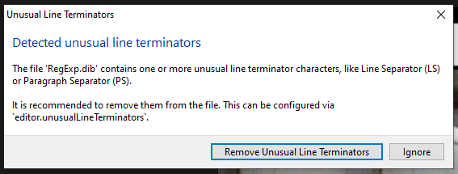

# How to RegExp

## What is needed?  

- VS Code
- [.NET Interactive Notebooks](https://marketplace.visualstudio.com/items?itemName=ms-dotnettools.dotnet-interactive-vscode) extension

When you open the `.dib` file you will get the following popup:

**Click the button [Ignore]**  
If not ignored some regex examples will fail

## Presenting

When you have done that you're ready to present about Regex!

Both parts are about 30 minutes to present.  
However I do not recommend to present both in one session since that can be a lot of information.

## LICENSE & Images

The MIT License is directed to the `RegExp.dib` file only!

I do not own the images, nor know the creators of them or have a license to show said images.  
If you are a creator of one of them and want your image to be removed contact me via Twitter.  
If you are a creator and want recognition of a image contact me via Twitter and I will add it.

My Twitter [@TessavWalstijn](https://twitter.com/TessavWalstijn)
